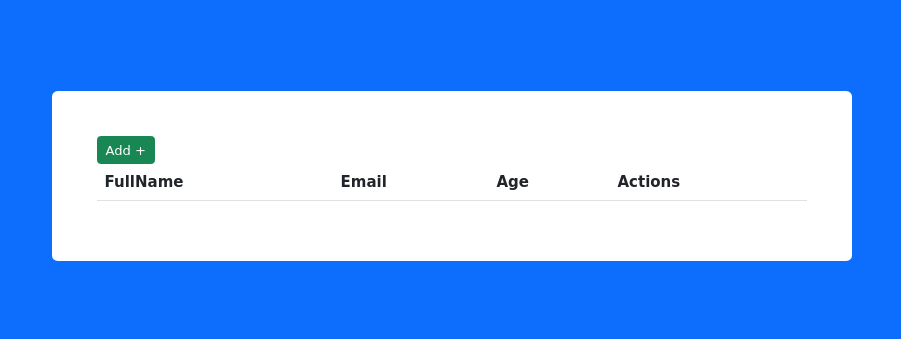
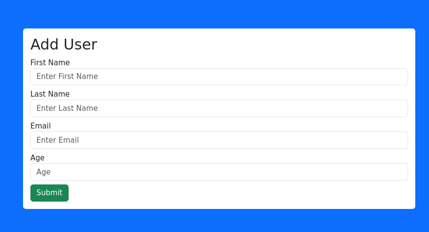

# CRUD DEMO App #

This is a fully functional DEMO of a CRUD built using React, it does not includes testing and requires refactor

## Concept ##
- CRUD operations
- It is just a project to be used as a Proof of Concept
- Refactor it first then use it as a template

## Version 1 specs ##

### Technical Stack ###
* Data storage: MongoDB [Backend is separate here](https://github.com/hftamayo/pfuserscrudbe)
* Content manager: Redux Toolkit
* CSS manager: Bootstrap
* React components and Axios

### Available Functions ###
* Add
* Read
* Update
* Delete

## Proof of Concept ##
[Todo]

## Branches ##
* OldStable : deprecated versions of the project
* Stable: current or latest official version
* Unstable: sourcecode that has not been tested and approved
* Experimental: sourcecode in progress

## Snapshots ##

## Bugs ##
Please refer to the Issues section in this repository

## References ##
[Original Tutorial](https://youtu.be/FOK45_sEqK8?si=-gDlkKC2v_UGQL3q)
